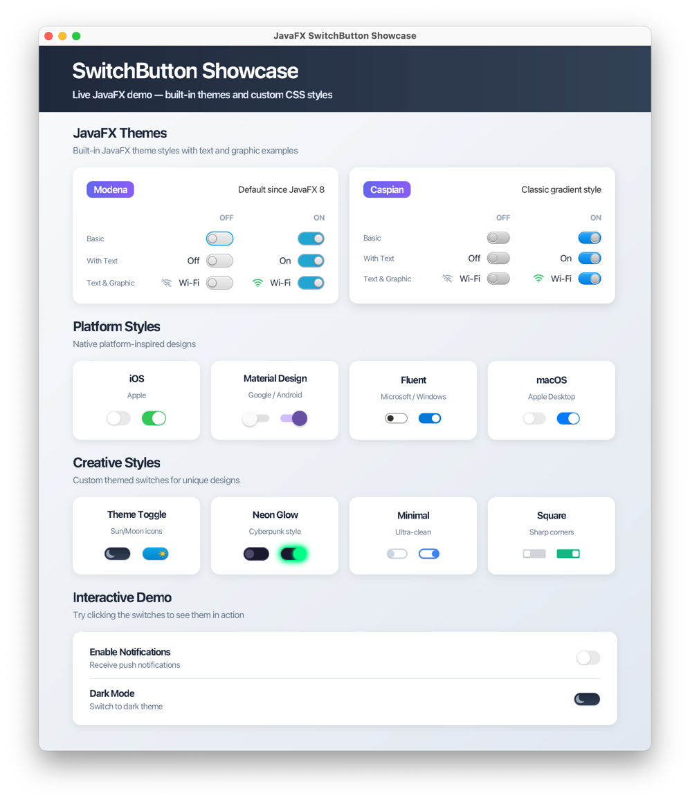

# SwitchButton Showcase

A demo application showcasing the proposed `SwitchButton` control for JavaFX.



## About

This project demonstrates a new `SwitchButton` control proposed for inclusion in JavaFX core. The showcase includes:

- **JavaFX Themes**: Modena and Caspian built-in styles
- **Platform Styles**: iOS, Material Design, Fluent (Windows), macOS
- **Creative Styles**: Theme toggle, Neon glow, Minimal, Square
- **Interactive Demo**: Real-world usage examples

## Motivation

The switch control has become a standard UI element across all major platforms. It provides users with a familiar, intuitive way to toggle binary on/off settings with immediate effect.

**Nearly all major UI frameworks include a built-in Switch component:**

| Platform/Framework | Built-in Switch Component |
|--------------------|---------------------------|
| SwiftUI (iOS/macOS) | ✓ Toggle |
| Android (Material) | ✓ MaterialSwitch |
| Flutter | ✓ Switch, CupertinoSwitch, SwitchListTile |
| React Native | ✓ Switch |
| Windows (WinUI/UWP) | ✓ ToggleSwitch |

Currently, JavaFX lacks a native Switch control. Developers must use third-party libraries like ControlsFX, create custom implementations, or style ToggleButton with custom CSS to simulate a switch appearance.

## Why Not Use CheckBox or ToggleButton?

### SwitchButton vs CheckBox

| Aspect | CheckBox | SwitchButton |
|--------|----------|--------------|
| States | Three (selected, unselected, indeterminate) | Two (on, off) |
| Effect timing | Usually requires form submission | Takes effect immediately |
| Typical use | Multiple selections in forms | System settings on/off |
| Visual form | Box + checkmark | Sliding track + circular thumb |

### SwitchButton vs ToggleButton

| Aspect | ToggleButton | SwitchButton |
|--------|--------------|--------------|
| ToggleGroup | Supported, for mutually exclusive selection | Not supported, for independent settings |
| Typical use | Select one from many (e.g., text alignment) | Independent binary settings |
| Visual form | Button appearance, pressed/released states | Sliding switch, clear on/off positions |
| User perception | "Select an option" | "Turn a feature on or off" |

SwitchButton is semantically unique: it is specifically designed to represent "an immediately-effective binary toggle state."

## Why Not Use ControlsFX's ToggleSwitch?

ControlsFX's ToggleSwitch has served the community well for many years. However, it has some architectural issues:

1. **Inconsistent Inheritance**: ToggleSwitch extends `Labeled` instead of `ButtonBase`, unlike similar toggle controls (CheckBox, RadioButton, ToggleButton).

2. **Labeled Properties Don't Work**: Most Labeled properties like `textFill`, `graphic`, `contentDisplay` cannot be used directly because the skin creates an internal Label instead of using the parent's rendering mechanism.

## Why Not Submit a PR to ControlsFX?

Fixing the issues in ControlsFX's ToggleSwitch would essentially require a complete rewrite:

1. **Different Internal Structure**: The component's internal layout and structure are fundamentally different. ToggleSwitch uses an internal Label, while a proper implementation should leverage the parent class's rendering mechanism.

2. **Massive Code Changes**: Over 90% of the code would need to be rewritten, including the control class, skin, and CSS styles.

3. **Breaking Change for Existing Users**: Such significant changes to layout and styling would break existing projects that depend on the current ToggleSwitch implementation.

4. **Essentially a New Component**: At this point, it's no longer a "fix" but creating an entirely new component.

5. **Belongs in Core**: Switch is a fundamental component in modern UI design. SwitchButton should be included in the JavaFX core library as a standard control.

Every major UI framework includes a built-in Switch component. JavaFX developers shouldn't need to add an external dependency for such a basic control.

## Proposed API

```java
public class SwitchButton extends ButtonBase {
    
    public SwitchButton()
    public SwitchButton(String text)

    // Selected state
    public final BooleanProperty selectedProperty()
    public final boolean isSelected()
    public final void setSelected(boolean value)
}
```

**Design Decisions:**

- Extends ButtonBase (consistent with CheckBox/RadioButton)
- Has selectedProperty (consistent with ToggleButton)
- No ToggleGroup support (Switches are for independent settings)
- No indeterminate state (Switch only has on/off states)
- Uses AccessibleRole.TOGGLE_BUTTON for accessibility. (tentative)

## Implementation Highlights

- **Ratio-based animation**: Uses thumbPosition ratio (0.0 to 1.0) instead of absolute translateX values
- **Separation of animation and layout**: Avoids conflicts between TranslateTransition and layoutChildren()
- **Full CSS theme support**: Provides styles for both Modena and Caspian themes
- **True Labeled property support**: text, textFill, graphic, contentDisplay all work correctly
- **Complete accessibility support**: Proper AccessibleRole and keyboard navigation

## Requirements

- JDK 24+
- Gradle 8.x

## Quick Start

```bash
# Clone the repository
git clone https://github.com/leewyatt/SwitchButtonShowcase.git
cd SwitchButtonShowcase

# Run the application
./gradlew run
```

On Windows:
```cmd
.\gradlew.bat run
```

## Project Structure

```
SwitchButtonShowcase/
├── libs/
│   ├── win/                    # Windows: JAR + DLL files
│   └── mac/                    # macOS: JAR + dylib files
├── screens/
│   └── screenshot.png          # Showcase screenshot
├── src/main/java/com/test/
│   └── SwitchButtonShowcase.java
├── src/main/resources/com/test/
│   └── showcase.css
├── build.gradle.kts
└── README.md
```

## Building JavaFX from Source

This project uses a locally built JavaFX with the `SwitchButton` control. To build it yourself:

```bash
# Clone the OpenJFX fork with SwitchButton
git clone https://github.com/leewyatt/jfx.git
cd jfx

# Switch to the feature branch
git checkout add-switch-button

# Build (requires JDK 24+)
./gradlew sdk

# Copy the built files to this project's libs folder
cp -r build/sdk/lib/* ../SwitchButtonShowcase/libs/<platform>/
```

## Related Links

- [SwitchButton Showcase](https://github.com/leewyatt/SwitchButtonShowcase)
- [OpenJFX Fork (SwitchButton branch)](https://github.com/leewyatt/jfx/tree/add-switch-button)
- [OpenJFX](https://github.com/openjdk/jfx)

## License

This project is for demonstration purposes as part of a JavaFX enhancement proposal.